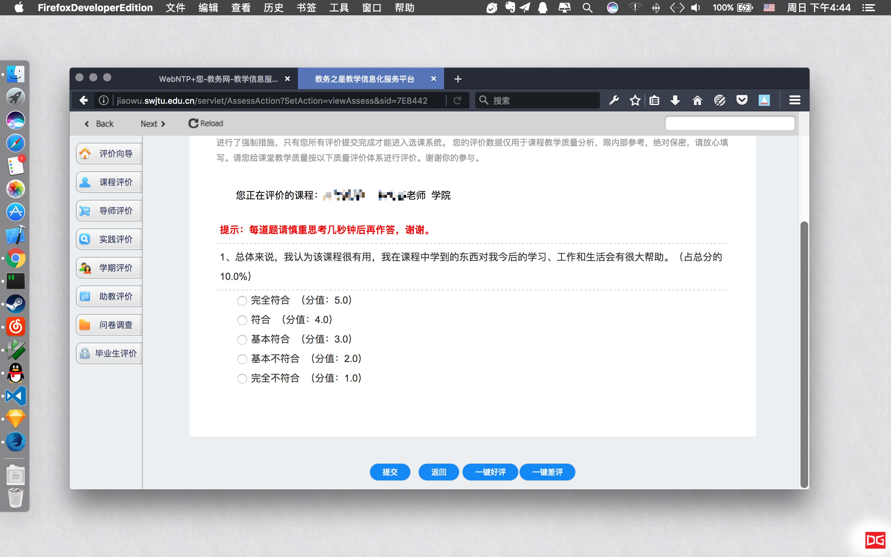

# HackSwjtuDeanPK-ff

Hackers assess courses with no time. 😎

## Feature

- [x] 一键课程评价 (2016.12.18 功能更新)
- [x] 一键导师评价 (2016.12.18 功能更新)
- [x] 一键暑期实习评价 (2016.12.18 功能更新)
- [x] 自助学期评价 (2016.12.18 功能更新)

## Description

针对于西南交通大学教务系统的一键课程评价的 Firefox 扩展程序。可以迅速在查看成绩之前迅速评价课程，避免时间浪费。随机生成课程评价，抛开脑洞。

## Screenshot

## MIT License

Copyright (c) 2016 Hack Swjtu

Permission is hereby granted, free of charge, to any person obtaining a copy
of this software and associated documentation files (the "Software"), to deal
in the Software without restriction, including without limitation the rights
to use, copy, modify, merge, publish, distribute, sublicense, and/or sell
copies of the Software, and to permit persons to whom the Software is
furnished to do so, subject to the following conditions:

The above copyright notice and this permission notice shall be included in all
copies or substantial portions of the Software.

THE SOFTWARE IS PROVIDED "AS IS", WITHOUT WARRANTY OF ANY KIND, EXPRESS OR
IMPLIED, INCLUDING BUT NOT LIMITED TO THE WARRANTIES OF MERCHANTABILITY,
FITNESS FOR A PARTICULAR PURPOSE AND NONINFRINGEMENT. IN NO EVENT SHALL THE
AUTHORS OR COPYRIGHT HOLDERS BE LIABLE FOR ANY CLAIM, DAMAGES OR OTHER
LIABILITY, WHETHER IN AN ACTION OF CONTRACT, TORT OR OTHERWISE, ARISING FROM,
OUT OF OR IN CONNECTION WITH THE SOFTWARE OR THE USE OR OTHER DEALINGS IN THE
SOFTWARE.
